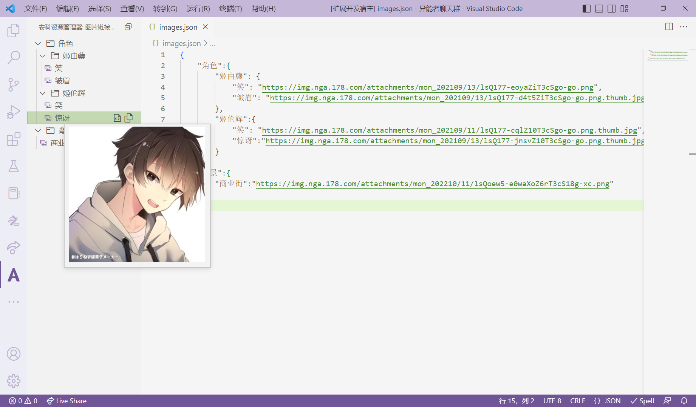

# 帮助文档

这是一个用于辅助安科(あんこスレ)的创作的vscode扩展。

QQ交流群群号：722865990

## 「安科」是什么？

以下介绍摘自「[萌娘百科-安科](https://zh.moegirl.org.cn/%E5%AE%89%E7%A7%91)」

> [安科](https://zh.moegirl.org.cn/%E5%AE%89%E7%A7%91)（日语：[あんこスレ](https://yaruo.fandom.com/wiki/%E3%81%82%E3%82%93%E3%81%93%E3%82%B9%E3%83%AC)）是起源于[AA漫画](https://zh.moegirl.org.cn/AA%E6%BC%AB%E7%94%BB)的一种剧情推进形式。
> 
> 创作者自己设定一些剧情走向（通常为10个选项），再通过随机点数决定进一步的剧情

目前国内的安科创作平台（仅列出了我知道的几个，不分先后）：

- [NGA论坛-二次元跑团综合版块](https://nga.178.com/thread.php?fid=784)
- [百度贴吧-安科吧](https://tieba.baidu.com/f?kw=%E5%AE%89%E7%A7%91)
- [骨碌碌文字世界](https://www.gululuworld.com/)
- [纯美苹果园](http://bbs.goddessfantasy.net/bbs)
- [寝不足创作](https://www.qinbuzu.com/)


## 功能

### 安科图片资源管理

安科里经常会用到图片，有的是只用一次的背景图，有的是在每句对话前添加的角色立绘差分图。

一些在NGA论坛创作安科的作者，采用的方式是先在同一层楼上传完需要用到的所有角色差分，将上传后得到的图片链接保存下来，在发布正文内容时就不需要重复上传图片附件了。这个功能就是为此设计的。



图片链接数据存储在一个json文件（扩展名为`.json`的数据文件）当中，内容大致长得像是这样：

```json
{
    "角色":{
        "姬由蘖": {
            "笑": "https://img.nga.178.com/attachments/mon_202109/13/lsQ177-eoyaZiT3cSgo-go.png",
            "皱眉": "https://img.nga.178.com/attachments/mon_202109/13/lsQ177-d4t5ZiT3cSgo-go.png.thumb.jpg"
        },
        "姬伦辉":{
            "笑": "https://img.nga.178.com/attachments/mon_202109/11/lsQ177-cqlZ10T3cSgo-go.png.thumb.jpg",
            "惊讶":"https://img.nga.178.com/attachments/mon_202109/13/lsQ177-jnsvZ10T3cSgo-go.png.thumb.jpg"
        }
    },
    "背景":{
        "商业街":"https://img.nga.178.com/attachments/mon_202210/11/lsQoew5-e0waXoZ6rT3cS18g-xc.png"
    }
}
```

示例json文件渲染到侧边栏的层级关系是：
- 角色
  - 姬由蘖
    - 笑
    - 皱眉
  - 姬伦辉
    - 笑
    - 惊讶
- 背景
  - 商业街


它的嵌套关系和“文件夹与文件”的关系差不多，“文件夹”（示例中的“角色”、“背景”、“姬由蘖”、“姬伦辉”等结点，一般是用于分类，方便管理）中可以嵌套任意层级的“文件夹”或者存放“文件”（示例中的“笑”、“皱眉”、“惊讶”、“商业街”等可以复制链接的结点，一般是角色的具体差分立绘）

在插件设置当中将这个文件的路径配置好之后，就可以在侧边栏看到渲染出来的结点了。

鼠标悬停在结点上可以预览这个图片（如果预览不出来可能是图片链接有问题），结点旁边有两个复制图标，一个是复制纯图片链接，一个是复制论坛图片代码（形似`[img]你的图片链接[/img]`）

如果不太清楚怎么弄，你可以手动复制上面的json数据，新建一个后缀名为`.json`的文件把内容粘贴进去，再将这个新建的文件的全路径配置到设置当中试试看。

目前这个版本还只能手动修改json文件，但之后是会做成不用手动修改的，敬请期待。

### Coming Soon

目前预备添加的功能：

- [x] 侧边栏图片资源管理器
- [ ] 侧边栏图片资源管理器优化，尽量使得不需要手动修改json文件
- [ ] markdown和NGA代码转化
- [ ] 快捷键输入NGA代码
- [ ] 自带骰子（含骰点记录）
- [ ] 骰点与选项的格式化

## 设置

本扩展有以下设置项，可以用快捷键`Ctrl+逗号`或者点击左下角齿轮图标找到设置面板，在设置面板中找到本扩展的设置项

- `ankosure-assistant.imagesDataPath`: 存放图片链接数据的json文件的路径，需要包含文件名。例如`F:/images.json`

